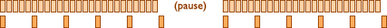
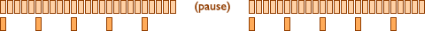
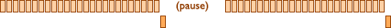
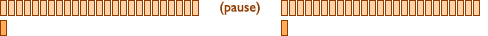

# jQuery throttle / debounce: 有时，少就是多！

[jQuery throttle / debounce: Sometimes, less is more!](http://benalman.com/projects/jquery-throttle-debounce-plugin/) 由 [Ivan Yan](http://yanxyz.net/) 翻译。译文版权["署名-非商用-相同方式共享"](http://creativecommons.org/licenses/by-nc-sa/4.0/)，意见[反馈](https://github.com/hongfanqie/debounce-throttle/issues)。注意本文只是选译。

## 节流与去弹跳

节流（throttle）与去弹跳（debounce）都是限制函数执行的频率，该用哪个？

简单的说：节流限制函数每多少毫秒执行一次，去弹跳保证函数只执行一次。

例如，你的函数的功能是切换状态，简单地节流这个函数不能满足需求，因为给出足够的时间，这个节流的函数仍然会执行超过一次。这时因为每个后续的执行会将状态恢复到它之前的值，所以节流不适合，但是去弹跳适合。

另一个例子，在一些浏览器下滚动事件接连发生，这意味着绑定的事件处理器执行次数（可能）比你想像的多。如果你的滚动事件处理器是在修改 DOM 或者是其它复杂操作，节流它可以让它执行得不那么频繁。

但是也许你不需要以一定的频率更新，只是想在用户完成滚动之后更新。这时去弹跳的滚动事件处理器让滚动事件直到用户完成滚动后发生。

当然，如果你想更进一步，你可以用一对去弹跳事件处理器（一个用 `at_begin` 参数，另一个不用）在滚动时做些操作比如设置 class 值。或者仅当用户移动鼠标时，或改变窗口大小时，或其它连续频繁发生的事件。查看[示例](http://jsfiddle.net/cowboy/cTZJU/show/)。

## 节流

使用 jQuery throttle / debounce，你可以传递一个延时和一个函数给 `$.throttle`，得到一个新函数，当它被重复调用时，在延时（ms）内只执行一次原始函数（在同样的作用域内以同样的参数）。

节流在限制 resize、scroll 等事件处理器调用频率上特别有用。看下面的用例或者亲自看看[节流示例](http://benalman.com/code/projects/jquery-throttle-debounce/examples/throttle/)。

### 图解

`$.throttle` 节流函数，使用不同的 `no_trailing` 参数会有点不同。

`no_trailing` 为 false 或末指定：



`no_trailing` 为 true:



要点：

-  代表一个节流函数的调用。
-  代表一个实际回调的调用。
-  之间的空白代表 `delay` 值。
-  是一个延时，比指定的 `delay` 值大。

### 示例

```javascript
function log( event ) {
  console.log( $(window).scrollTop(), event.timeStamp );
};

// 控制台打印发在鼠标滚动时，会比你想要的次数多。
$(window).scroll( log );

// 控制台打印发在鼠标滚动时，但是每 250ms 一次。
$(window).scroll( $.throttle( 250, log ) );

// jQuery 1.4+ 解绑事件，用节流的函数或原始的函数均可。
$(window).unbind( 'scroll', log );
```

## 去弹跳

使用 jQuery throttle / debounce，你可以传递一个延时和一个函数给 `$.debounce`，得到一个新函数，当它被重复调用时，一个批次的调用只执行一次原始函数，高效地将多个连续的调用积累为一个调用，在这个批次的开始或者结尾执行。查看[这篇文章](http://unscriptable.com/index.php/2009/03/20/debouncing-javascript-methods/)了解更多。

去弹跳在限制 AJAX 事件处理器执行频率上特别有用。看下面的用例或者亲自看看[去弹跳示例](http://benalman.com/code/projects/jquery-throttle-debounce/examples/debounce/)。

### 图解

`$.debounce` 去弹跳函数，使用不同的参数 `at_begin` 会有点不同：

`at_begin` 为 false 或末指定：



`at_begin` 为 true:



要点：

-  代表一个去弹跳函数的调用。
-  代表一个实际回调的调用。
-  是一个延时，比指定的 `delay` 值大。

### 示例

```javascript
function ajax_lookup( event ) {
  // AJAX 查询 $(this).val();
};

// 控制台打印发在每次单个按键松开时，会比你想要的次数多。
$('input:text').keyup( ajax_lookup );

// 控制台打印发在按键松开时，但是只有在用户停止敲击 250ms 之后。
$('input:text').keyup( $.debounce( 250, ajax_lookup ) );

// jQuery 1.4+ 解绑事件，用去弹跳的函数或原始的函数均可。
$('input:text').unbind( 'keyup', ajax_lookup );
```

查看[文档](http://benalman.com/code/projects/jquery-throttle-debounce/docs/)了解用法，查看[节流例子](http://benalman.com/code/projects/jquery-throttle-debounce/examples/throttle/)与[去弹跳例子](http://benalman.com/code/projects/jquery-throttle-debounce/examples/debounce/)。

如果你想提交 bug, 请在 [issues](http://github.com/cowboy/jquery-throttle-debounce/issues) 提交，谢谢！
